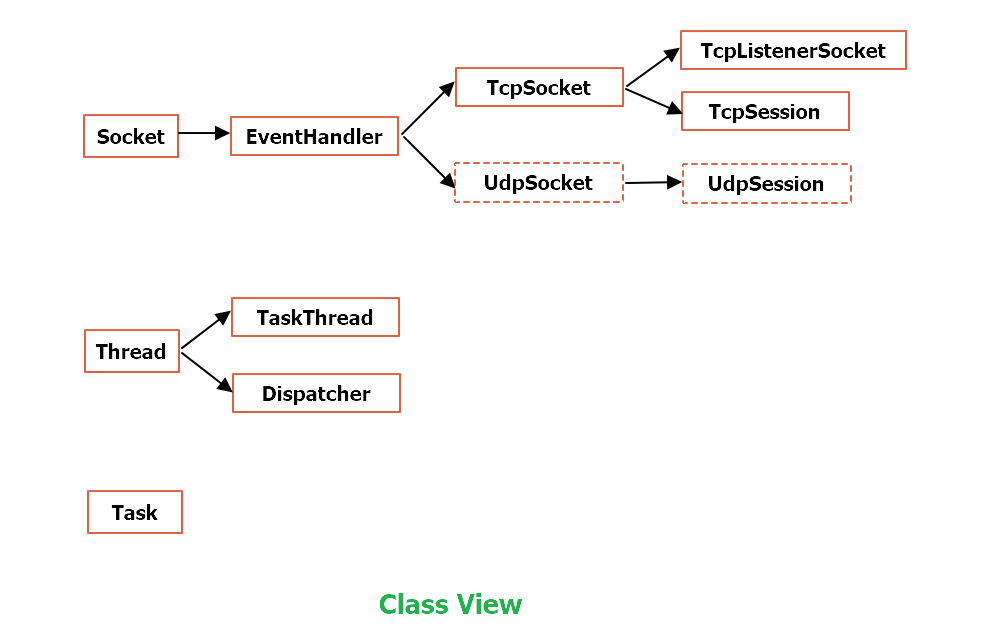
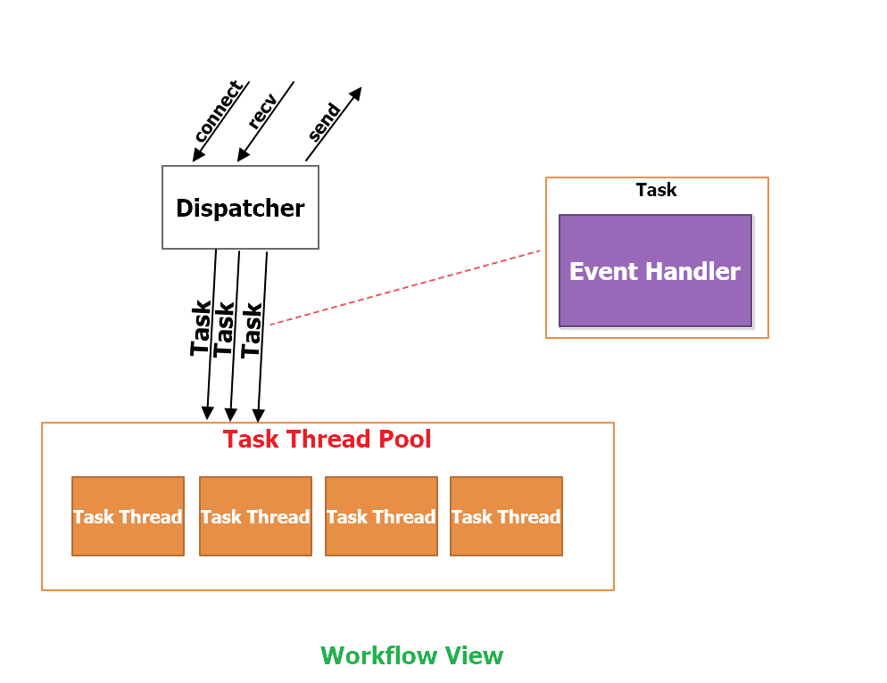
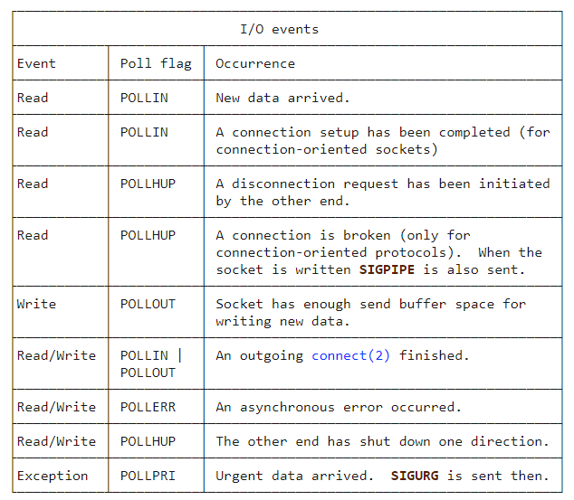
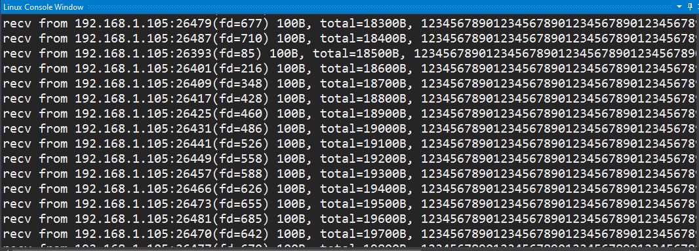

# Introduction

**Platform**: Linux

Reactor模式的一个实现,可以应当高并发场景下不同任务的处理.

# Classes View

- **Socket**  

**通讯基类**,主要实现底层通讯接口  

- **EventHandler**  

**事件基类**,不进行实例化,派生出TcpSocket,UdpSocket事件类  

- **TcpSocket**  

**事件类**,所有基于Tcp有连接的事件都可以由该类派生  

- **UdpSocket**  

**事件类**,所有基于Udp无连接的事件都可以由该类派生  

- **TcpListenerSocket**  

**事件类**,用于处理具体的Tcp连接事件(在handle_event内进行),如果有新的连接,就会创建一个TcpSession事件对象,并注册到Dispatcher上,这样,当Dispathcer收到这个新连接的数据时,就会使用TcpSession中的handle_event来进行处理  
UdpSocket事件类,用于处理具体的Udp事件(在handle_event内进行),根据不同的场景应用,可以由该类派生出不同的UdpSession,或者其他类来分别做针对不同场景的处理  

# Workflow View

首先需要了解事件,事件主要分为**读事件**和**写事件**,在Linux下的epoll中分类如下:

**所有的事件类都需要实现handle_event这个接口,如果该事件被触发,则会自动调用handle_event接口,因此不同的事件类就可以进行不同的处理**  

每个事件都需要先进行request_event,并注明请求读/写事件,然后才会被触发. 事件一旦到来,就会调用该事件对应的handle_event函数,因此,不同的事件类中的handle_event不同,这样也就可以处理各种各样的事件了.  

需要清楚的是,要创建不同的事件,需要通过派生(TcpSocket或UdpSocket)并实现handle_event接口来完成.  

**为了处理的更高效,添加了任务线程池**  

为什么需要任务类(Task)?  
试想如果是读事件中的recv消息,一瞬间并发了10次,将这10次,每一次都看作是读事件的任务即可,这样,这10次任务都携带同一个EventHandler
再把这10次任务放进任务线程池,大量线程(数量一般根据cpu核数来进行创建)同时处理10次任务,这样是不是比单独一个线程处理高效得多呢!不过当然要注意在线程之间资源竞争导致访问冲突(加锁的必要性)  

每当事件被触发后,Dispatcher会创建一个任务(Task)并将触发的事件类型(读/写)写入flags,然后从线程池pick一个任务线程,放入该线程的任务队列
任务线程在entry中将任务从任务队列中取出,并调用任务的run函数(run函数内部调用EventHandler对象的handle_event),从而处理了不同事件  

# Test

并发连接的测试

# BUGS
这只是reactor模式实现的一个雏形,可以根据该雏形进行扩展,派生不同类型的事件,进而处理不同场景下的问题

# Authors
- Brian Yi